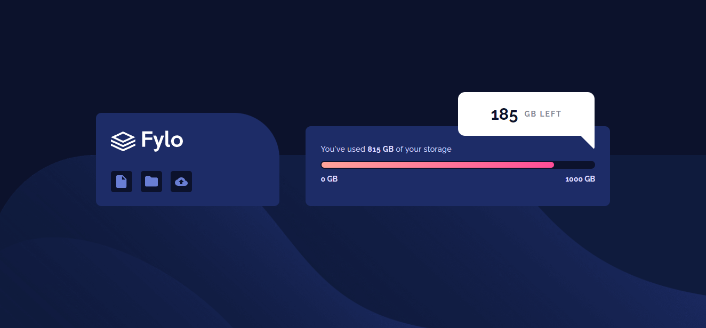

# Frontend Mentor - Fylo data storage component solution

This is a solution to the [Fylo data storage component challenge on Frontend Mentor](https://www.frontendmentor.io/challenges/fylo-data-storage-component-1dZPRbV5n). Frontend Mentor challenges help you improve your coding skills by building realistic projects. 

## Table of contents

- [Overview](#overview)
- [Screenshot](#screenshot)
- [Links](#links)
- [Built with](#built-with)
- [Useful resources](#useful-resources)
- [Author](#author)

### Overview
This project (Fylo data storage component), designed to make users able to view the optimal layout for the site depending on their device's screen size

### Screenshot

### Links

- [Solution URL : Fylo-GitHub](https://github.com/Iman-mohammad/fylo-data-storage.github.io)
- [Live Site URL : Fylo-data-storage](https://iman-mohammad.github.io/fylo-data-storage.github.io/)

### Built with

- Semantic HTML5 markup
- CSS custom properties
- Flexbox
- Media Query

### Useful resources

- [MDN](https://developer.mozilla.org/en-US/)
- [W3school](https://www.w3schools.com) 
- [StackOverflow](https://stackoverflow.com)

### Author

- Frontend Mentor - [@Iman-mohammad](https://www.frontendmentor.io/profile/Iman-mohammad)
- LinkedIn - [@iman-mohammad](https://www.linkedin.com/in/iman-mohammad-340017220)

